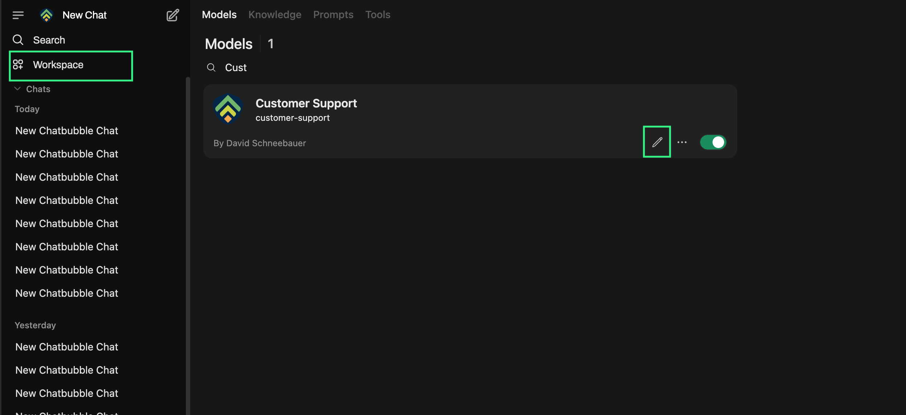
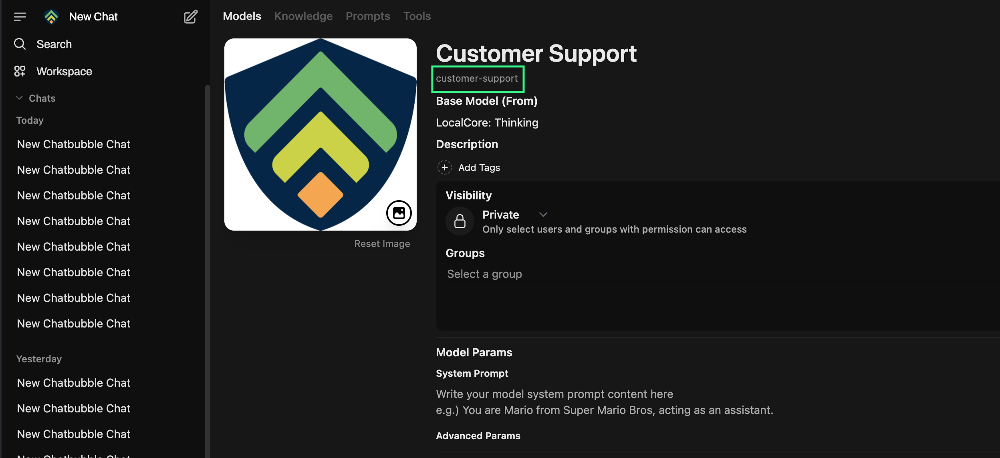

# HeadwAI Chat Bubble

**🎮 Try it live:** Experience the HeadwAI Chat Bubble at [chat-bubble.headwai.org](https://chat-bubble.headwai.org/) - configure and test all features in a live environment.

## Features

- 🚀 Easy integration into any Website
- 💬 Connect to any [HeadwAI ONE](https://www.headwai.org/headwai-one) Assistant or [Open WebUI](https://openwebui.com) Model
- 📋 Review conversations in [HeadwAI ONE](https://www.headwai.org/headwai-one) or [Open WebUI](https://openwebui.com) instance
- 👍 Give Feedback on messages
- 📥 Download Conversations in HeadwAI Chat Bubble
- ✅ Terms of Use Check
- 🎨 Fully brandable
- 📱 Responsive design
- 🎨 Customizable UI components
- 🌍 Internationalization (i18n) support - Auto-detects browser language
- 🇬🇧🇩🇪 Multi-language support (English, German)

### Easy Website Integration

Add the HeadwAI Chat Bubble to the respective .html file.

```html
<!DOCTYPE html>
<html>
  <head>
    <title>Customer Website</title>
    <!-- Configure via global variables -->
    <script>
      // Runtime configuration override
      window.HEADWAI_CHAT_BUBBLE_CONFIG = {
        apiUrl: 'https://company.headwai-one.at',
        apiKey: 'your-api-key-here',
        assistantId: 'customer-support-assistant-id',
        maxMessages: 0,
        placeholderText: 'Ask your question here!',
        faviconPath: 'https://cdn.company.at/icons/favicon.svg',
        initialMessage: 'Hey! My name is Supporty, how can I help you?',
        chatTitle: 'Customer Support',
        userMessageBackgroundColor: '#007bff',
        aiMessageBackgroundColor: '#f1f3f4',
        userMessageTextColor: '#000000',
        aiMessageTextColor: '#000000',
        faviconBackgroundColor: '#667eea',
        fontFamily: '"Inter", system-ui, sans-serif',
        fontSize: '16px',
        locale: 'de-DE',
        disclaimerTitle: 'Terms of Service',
        disclaimerMessage: 'Please accept our terms before using this service.',
        infoTitle: 'Support Information',
        infoMessage: 'For help, contact support@example.com',
      };
    </script>
  </head>
  <body>
    <!-- Your existing content -->

    <!-- HeadwAI Chat Bubble Integration - Auto-initializes! -->
    <div id="chat-bubble-container"></div>

    <!-- Include from jsDelivr CDN -->
    <link
      rel="stylesheet"
      href="https://cdn.jsdelivr.net/npm/@headwai/chat-bubble@latest/dist-widget/chat-bubble.css"
    />
    <script src="https://cdn.jsdelivr.net/npm/@headwai/chat-bubble@latest/dist-widget/chat-bubble.js"></script>
  </body>
</html>
```

Set the configuration of the HeadwAI Chat Bubble in the `<script>` tag of the `<head>`.
Get the desired version of the JavaScript and CSS in your `<body>`.

```html
<!-- Latest version -->
<link
  rel="stylesheet"
  href="https://cdn.jsdelivr.net/npm/@headwai/chat-bubble@latest/dist-widget/chat-bubble.css"
/>
<script src="https://cdn.jsdelivr.net/npm/@headwai/chat-bubble@latest/dist-widget/chat-bubble.js"></script>

<!-- Specific version -->
<link
  rel="stylesheet"
  href="https://cdn.jsdelivr.net/npm/@headwai/chat-bubble@1.0.0/dist-widget/chat-bubble.css"
/>
<script src="https://cdn.jsdelivr.net/npm/@headwai/chat-bubble@1.0.0/dist-widget/chat-bubble.js"></script>
```

Place the HeadwAI Chat Bubble into the `<body>` tag. It will appear on the right corner of your website.

#### Multiple HeadwAI Chat Bubbles

For multiple instances use data attributes of the `<div>` tag for configuration instead.

```html
<!-- HeadwAI Chat Bubble with specific configuration -->
<div
  data-chat-bubble
  data-chat-bubble-api-url="https://company.headwai-one.at"
  data-chat-bubble-api-key="your-api-key-here"
  data-chat-bubble-assistant-id="customer-support-assistant-id"
  data-chat-bubble-max-messages="0"
  data-chat-bubble-placeholder-text="Ask your question here!"
  data-chat-bubble-favicon-path="https://cdn.company.at/icons/favicon.svg"
  data-chat-bubble-initial-message="Hey! My name is Supporty, how can I help you?"
  data-chat-bubble-chat-title="Customer Support"
  data-chat-bubble-user-message-background-color="#007bff"
  data-chat-bubble-ai-message-background-color="#f1f3f4"
  data-chat-bubble-user-message-text-color="#000000"
  data-chat-bubble-ai-message-text-color="#000000"
  data-chat-bubble-favicon-background-color="#667eea"
  data-chat-bubble-font-family='"Inter", system-ui, sans-serif'
  data-chat-bubble-font-size="16px"
  data-chat-bubble-disclaimer-title="Terms of Service"
  data-chat-bubble-disclaimer-message="Please accept our terms before using this service"
  data-chat-bubble-info-title="Support Information"
  data-chat-bubble-info-message="For help, contact support@example.com"
></div>

<!-- Another HeadwAI Chat Bubble with different config -->
<div
  data-chat-bubble
  data-chat-bubble-api-url="https://company.headwai-one.at"
  data-chat-bubble-api-key="your-api-key-here"
  data-chat-bubble-assistant-id="faq-assistant-id"
  data-chat-bubble-max-messages="10"
  data-chat-bubble-placeholder-text="Ask about our FAQ..."
  data-chat-bubble-favicon-path="https://cdn.company.at/icons/faq-icon.svg"
  data-chat-bubble-initial-message="Hello! I can help you with frequently asked questions."
  data-chat-bubble-chat-title="FAQ Assistant"
  data-chat-bubble-user-message-background-color="#28a745"
  data-chat-bubble-ai-message-background-color="#e9ecef"
  data-chat-bubble-user-message-text-color="#ffffff"
  data-chat-bubble-ai-message-text-color="#495057"
  data-chat-bubble-favicon-background-color="#28a745"
  data-chat-bubble-font-family='"Roboto", sans-serif'
  data-chat-bubble-font-size="14px"
></div>

<link
  rel="stylesheet"
  href="https://cdn.jsdelivr.net/npm/@headwai/chat-bubble@latest/dist-widget/chat-bubble.css"
/>
<script src="https://cdn.jsdelivr.net/npm/@headwai/chat-bubble@latest/dist-widget/chat-bubble.js"></script>
```

## Configuration

The HeadwAI Chat Bubble can be configured using either the global `window.HEADWAI_CHAT_BUBBLE_CONFIG` object or data attributes on individual HeadwAI Chat Bubble elements. Below are all available configuration options:

### Required Configuration

#### `apiUrl`

**Type:** `string` | **Required:** ✅ | **Default:** `'https://localhost'`
The base URL of your HeadwAI ONE or Open WebUI API endpoint where the HeadwAI Chat Bubble will send messages. This is the same URL you access your HeadwAI ONE or Open WebUI instance in the web browser.

```javascript
apiUrl: 'https://company.headwai-one.at';
```

#### `apiKey`

**Type:** `string` | **Required:** ⚠️ (Conditional) | **Default:**
API key for authentication with the API. This is **required** when using the HeadwAI Chat Bubble with a plain [Open WebUI](https://github.com/open-webui/open-webui) instance. When used with a HeadwAI ONE instance an API key is not needed.

```javascript
apiKey: 'your-api-key-here';
```

**When to use:**

- ✅ **Required** for [Open WebUI](https://openwebui.com) instances
- ⚠️ **Not Required** for [HeadwAI ONE](https://www.headwai.org/headwai-one) instances.

#### `assistantId`

**Type:** `string` | **Required:** ✅  
The identifier of the AI assistant to use for generating responses. This should match an assistant configured in your [HeadwAI ONE](https://www.headwai.org/headwai-one) or a model configured in your [Open WebUI](https://openwebui.com) instance.

```javascript
assistantId: 'customer-support-assistant-id';
```

1. **Navigate to Assistant or Model**: Login to [HeadwAI ONE](https://www.headwai.org/headwai-one) or [Open WebUI](https://openwebui.com) with the dedicated HeadwAI Chat Bubble user (Or any other user that is allowed to see the desired assistant/model) and click on the `Workspace` menu, then select `Assistants` or `Models`. Search for the name of the desired assistant/model (Or create one). Click onto the edit-`Pen`.

  

1. **Copy Assistant Id or Model Id**: Now the assistant/model is displayed with its `name` and right underneath the `assistant-id`/`model-id`. Copy the `assistant-id`/`model-id`.

  

### Optional Configuration

#### `maxMessages`

**Type:** `number` | **Default:** `0` (unlimited)  
Limits the number of messages stored in the conversation history in one singel conversation. Set to `0` for unlimited messages, or specify a positive number to limit history.

```javascript
maxMessages: 10; // Keep and use only last 10 messages
```

#### `placeholderText`

**Type:** `string` | **Default:** `'Enter your questions here'`  
The placeholder text displayed in the message input field when it's empty.

```javascript
placeholderText: 'Ask your question here!';
```

#### `faviconPath`

**Type:** `string` | **Default:** `'./icons/favicon.svg'`  
Path or URL to the icon displayed on the HeadwAI Chat Bubble toggle button. Can be a relative path or absolute URL.

```javascript
faviconPath: 'https://cdn.company.at/icons/favicon.svg';
```

#### `initialMessage`

**Type:** `string` | **Default:** `'Hey, how can I help you?'`  
An optional welcome message that appears when the chat is first opened. If not set, no initial message is displayed.

```javascript
initialMessage: 'Hey! My name is Supporty, how can I help you?';
```

#### `chatTitle`

**Type:** `string` | **Default:** `'HeadwAI Chat Bubble'`  
The title displayed in the chat window header at the top of the chat interface. After the first AI response, this title will be automatically replaced with a generated title based on the conversation content.

```javascript
chatTitle: 'Customer Support';
```

#### `locale`

**Type:** `string` | **Default:** Auto-detected from browser  
Sets the language/locale for the widget interface. The widget automatically chooses the locale based on the following priority:

1. **Configuration override** - Explicitly set via `locale` parameter
2. **Browser language** - Auto-detected from `navigator.language`
3. **Fallback** - Defaults to English (en-GB) if unsupported language

```javascript
locale: 'de-DE'; // Force German interface
```

**Supported Languages:**

- `'en-GB'` - English (United Kingdom) - Default
- `'de-DE'` - German (Germany)
- `'de-AT'` - German (Austria)

If your browser is set to German (de-DE, de-AT, or just "de"), the widget will automatically display German text. For all other languages, it falls back to English.

### Styling Configuration

#### `userMessageBackgroundColor`

**Type:** `string` | **Default:** `'#007bff'`  
Background color for messages sent by the user. Accepts any valid CSS color value.

```javascript
userMessageBackgroundColor: '#007bff';
```

#### `aiMessageBackgroundColor`

**Type:** `string` | **Default:** `'#f1f3f4'`  
Background color for messages sent by the HeadwAI Chat Bubble. Accepts any valid CSS color value.

```javascript
aiMessageBackgroundColor: '#f1f3f4';
```

#### `userMessageTextColor`

**Type:** `string` | **Default:** `'#000000'`  
Text color for user messages. Accepts any valid CSS color value.

```javascript
userMessageTextColor: '#ffffff';
```

#### `aiMessageTextColor`

**Type:** `string` | **Default:** `'#000000'`  
Text color for HeadwAI Chat Bubble messages. Accepts any valid CSS color value.

```javascript
aiMessageTextColor: '#333333';
```

#### `feedbackMessageBackgroundColor`

**Type:** `string` | **Default:** `'#ffffff'`  
Background color for feedback buttons (thumbs up/down). Accepts any valid CSS color value.

```javascript
feedbackMessageBackgroundColor: '#ffffff';
```

#### `feedbackMessageTextColor`

**Type:** `string` | **Default:** `'#000000'`  
Text color for feedback buttons (thumbs up/down). Accepts any valid CSS color value.

```javascript
feedbackMessageTextColor: '#000000';
```

#### `faviconBackgroundColor`

**Type:** `string` | **Default:** `'#667eea'`  
Primary color used throughout the chat interface. This color is applied to:

- The HeadwAI Chat Bubble icon background
- The chat header background
- The submit button background

This provides a consistent color theme across the entire chat widget.

```javascript
faviconBackgroundColor: '#667eea';
```

#### `fontFamily`

**Type:** `string` | **Default:** `'inherit'`  
Font family used for all text in the chat interface, including messages and the input field. Accepts any valid CSS font-family value.

```javascript
fontFamily: '"Inter", system-ui, sans-serif';
fontFamily: '"Roboto", "Helvetica Neue", Arial, sans-serif';
fontFamily: 'system-ui, -apple-system, sans-serif';
```

**Note:** When using Google Fonts or other web fonts, make sure to include the appropriate `<link>` tag in your HTML `<head>` section:

```html
<head>
  <!-- For Google Fonts -->
  <link rel="preconnect" href="https://fonts.googleapis.com" />
  <link rel="preconnect" href="https://fonts.gstatic.com" crossorigin />
  <link
    href="https://fonts.googleapis.com/css2?family=Inter:wght@400;500;600&display=swap"
    rel="stylesheet"
  />

  <!-- Your HeadwAI Chat Bubble configuration -->
  <script>
    window.HEADWAI_CHAT_BUBBLE_CONFIG = {
      // ... other config
      fontFamily: '"Inter", system-ui, sans-serif',
    };
  </script>
</head>
```

#### `fontSize`

**Type:** `string` | **Default:** `'inherit'`  
Font size used for all text in the chat interface. Accepts any valid CSS font-size value.

```javascript
fontSize: '16px';
fontSize: '1rem';
fontSize: '14px';
```

### Disclaimer and Info Configuration

#### `disclaimerTitle`

**Type:** `string` | **Default:** Translation-based (`'Terms of <strong>Service</strong>'` in English, `'Nutzungs<strong>bedingungen</strong>'` in German)  
Title displayed in the initial disclaimer dialog that users must accept before using the chat. This appears when the chat is first opened and the user hasn't previously accepted the terms.

**HTML Support:** ✅ This field supports HTML formatting for rich text display. Content is automatically sanitized for security - see [HTML Content Sanitization](#html-content-sanitization) for details.

```javascript
disclaimerTitle: 'Privacy <strong>Notice</strong>';
disclaimerTitle: 'Terms of <em>Service</em>';
```

#### `disclaimerMessage`

**Type:** `string` | **Default:** Translation-based disclaimer message with HTML formatting  
Main message text displayed in the initial disclaimer dialog. This is the content users must read and accept before they can start chatting.

**HTML Support:** ✅ This field supports HTML formatting including headings, lists, links, and text formatting. Content is automatically sanitized for security - see [HTML Content Sanitization](#html-content-sanitization) for details.

```javascript
disclaimerMessage: `<p>By using this service, you agree to:</p>
<ul>
  <li><strong>Privacy:</strong> Your data is protected</li>
  <li>See <a href="/terms">full terms</a></li>
</ul>`;
```

#### `infoTitle`

**Type:** `string` | **Default:** Translation-based (`'Information'` in English, `'Informationen'` in German)  
Title displayed in the info overlay that can be accessed via the info button (ⓘ) in the chat header. This provides users with additional information about the service after they've started chatting.

**HTML Support:** ✅ This field supports HTML formatting for rich text display. Content is automatically sanitized for security - see [HTML Content Sanitization](#html-content-sanitization) for details.

```javascript
infoTitle: 'How This <em>Works</em>';
infoTitle: 'Support <strong>Information</strong>';
```

#### `infoMessage`

**Type:** `string` | **Default:** Translation-based info message with HTML formatting  
Content displayed in the info overlay accessible via the info button. Use this to provide help information, contact details, or explain how the AI assistant works.

**HTML Support:** ✅ This field supports HTML formatting including headings, lists, links, code blocks, and blockquotes. Content is automatically sanitized for security - see [HTML Content Sanitization](#html-content-sanitization) for details.

```javascript
infoMessage: `<h4>How We Help</h4>
<p>Our AI assistant uses advanced technology. Features:</p>
<ul>
  <li>Real-time responses</li>
  <li>Secure <code>encryption</code></li>
</ul>
<blockquote>Contact support@company.com for help</blockquote>`;
```

**Note:** The disclaimer and info content serve different purposes:

- **Disclaimer**: Legal/privacy notice shown once before first use (requires acceptance)
- **Info**: Helpful information accessible anytime via the info button in the chat header

### Security and HTML Content

#### HTML Content Sanitization

All HTML content in `disclaimerTitle`, `disclaimerMessage`, `infoTitle`, and `infoMessage` is automatically sanitized using **DOMPurify**, the industry-standard HTML sanitization library, to prevent XSS (Cross-Site Scripting) attacks while preserving safe formatting.

**Why DOMPurify:**

- **Battle-tested**: Used by millions of websites and applications worldwide
- **Security expertise**: Maintained by security researchers who understand XSS attack vectors
- **Regular updates**: Continuously updated to protect against new threats
- **Performance**: Optimized for speed and efficiency
- **Comprehensive**: Handles edge cases and browser inconsistencies

**Allowed HTML Tags:**

**For Message Content** (`disclaimerMessage`, `infoMessage`):

- **Text formatting**: `<strong>`, `<b>`, `<em>`, `<i>`, `<u>`, `<code>`, `<span>`
- **Structure**: `<p>`, `<h1>` through `<h6>`, `<br>`, `<ul>`, `<ol>`, `<li>`, `<blockquote>`
- **Links**: `<a>` (with validated `href`, `title`, `target` attributes)

**For Titles** (`disclaimerTitle`, `infoTitle`):

- **Basic formatting only**: `<strong>`, `<b>`, `<em>`, `<i>`, `<code>`, `<span>`
- **No links or structural elements** for security and UI consistency

**Security Features:**

- **Automatic threat removal**: Dangerous tags like `<script>`, `<iframe>`, `<object>` are completely removed
- **Attribute sanitization**: Dangerous attributes like `onclick`, `onerror`, `style` are stripped
- **URL validation**: Links only allow `http://`, `https://`, `mailto:`, and relative URLs
- **Protocol blocking**: JavaScript URLs (`javascript:`) and data URLs (`data:`) are blocked
- **Link security**: External links automatically get `rel="noopener noreferrer"` for security

**Examples of Safe HTML Content:**

```javascript
// ✅ Safe and allowed content
disclaimerMessage: `<p>By using this service, you agree to:</p>
<ul>
  <li><strong>Privacy:</strong> Your data is <em>protected</em></li>
  <li>Use <code>secure connections</code> only</li>
  <li>See our <a href="/terms" target="_blank">full terms</a></li>
</ul>
<blockquote>Your privacy is our priority</blockquote>`;

// ✅ Safe title formatting
disclaimerTitle: 'Terms of <strong>Service</strong>';
infoTitle: 'How This <em>Works</em>';
```

**Examples of Content That Gets Sanitized:**

```javascript
// ❌ Dangerous content (automatically removed/sanitized)
input: '<script>alert("XSS")</script>Terms of Service';
output: 'Terms of Service'; // Script tag completely removed

input: 'Safe image';
output: 'Safe image'; // onerror attribute stripped

input: '<a href="javascript:alert(1)">Click me</a>';
output: '<a>Click me</a>'; // Dangerous href removed

input: '<p onclick="malicious()">Click me</p>';
output: '<p>Click me</p>'; // onclick attribute stripped
```

**Testing Sanitization:**

To verify that your HTML content is properly sanitized, you can test with potentially dangerous input:

```javascript
// Test configuration with malicious content
window.HEADWAI_CHAT_BUBBLE_CONFIG = {
  disclaimerTitle: '<script>alert("XSS")</script>Safe <strong>Title</strong>',
  disclaimerMessage: `
    <p>Safe content</p>
    
    <a href="javascript:void(0)">Dangerous link</a>
    <a href="https://safe-site.com">Safe link</a>
  `,
};
```

If sanitization is working correctly, no JavaScript alerts will appear, and only safe HTML will be rendered.

**Maintenance:**

- DOMPurify is automatically updated through npm updates
- The widget uses the latest version of DOMPurify for maximum security
- No manual maintenance of sanitization rules is required

### Data Attribute Format

When using data attributes for multiple HeadwAI Chat Bubbles, convert camelCase property names to kebab-case with the `data-chat-bubble-` prefix:

- `apiUrl` → `data-chat-bubble-api-url`
- `apiKey` → `data-chat-bubble-api-key`
- `chatTitle` → `data-chat-bubble-chat-title`
- `userMessageBackgroundColor` → `data-chat-bubble-user-message-background-color`
- `initialMessage` → `data-chat-bubble-initial-message`
- `disclaimerTitle` → `data-chat-bubble-disclaimer-title`
- `disclaimerMessage` → `data-chat-bubble-disclaimer-message`
- `infoTitle` → `data-chat-bubble-info-title`
- `infoMessage` → `data-chat-bubble-info-message`

## Troubleshooting

### Common Issues

**CORS Errors**: Ensure your API endpoint allows requests from your domain  
**HTML Content Issues**: If custom HTML in disclaimer/info fields isn't rendering as expected, check the [HTML Content Sanitization](#html-content-sanitization) section for allowed tags and attributes
**CDN Version Delays**: Sometimes the `@latest` tag on jsDelivr CDN takes time to propagate to all edge servers and may not deliver the newest version immediately. If you need the latest features or fixes, specify the exact version number instead of using `@latest`:

```html
<!-- Instead of @latest -->
<link
  rel="stylesheet"
  href="https://cdn.jsdelivr.net/npm/@headwai/chat-bubble@1.2.3/dist-widget/chat-bubble.css"
/>
<script src="https://cdn.jsdelivr.net/npm/@headwai/chat-bubble@1.2.3/dist-widget/chat-bubble.js"></script>
```

## License

This project is licensed under the MIT License – see the [LICENSE](LICENSE) file for details.
Future versions of this project may be released under a different license.

## Third-Party Software

See [THIRD_PARTY_LICENSES.md](THIRD_PARTY_LICENSES.md) for license information of third-party dependencies.

# Contributing

Thank you for contributing!

By submitting a pull request, you agree to the terms of the
[Contributor License Agreement (CLA)](CLA.md).

Please ensure that:

- You have the right to submit the contribution
- Your contribution is your own work
